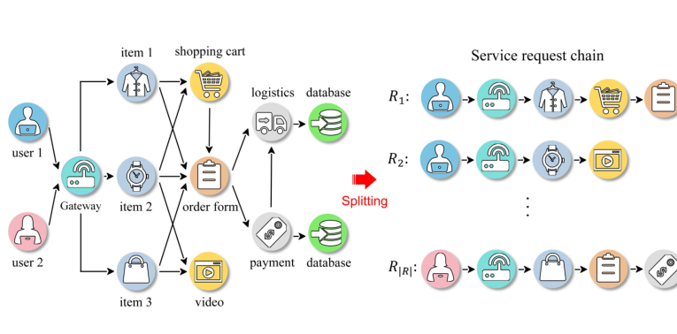
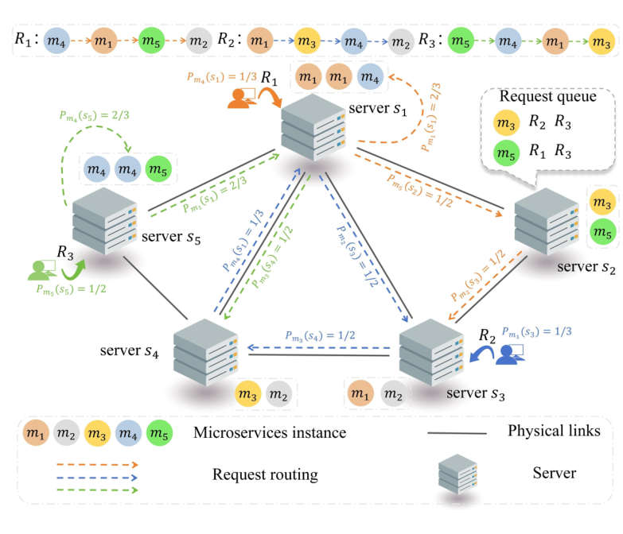
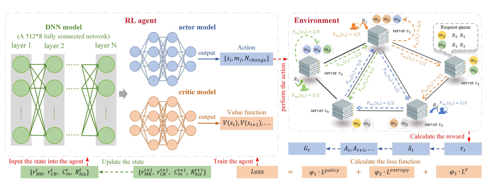
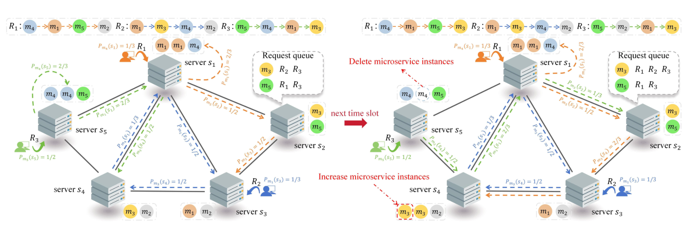
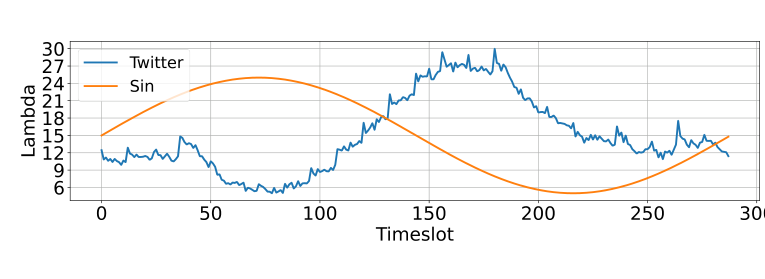
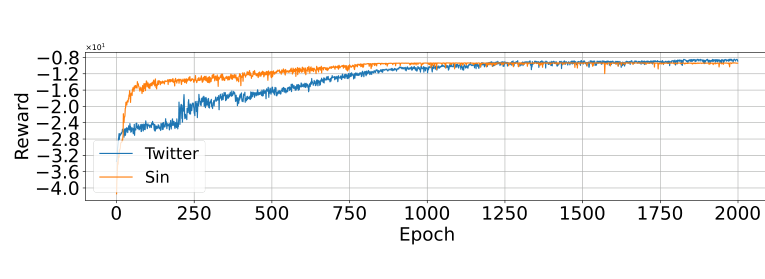
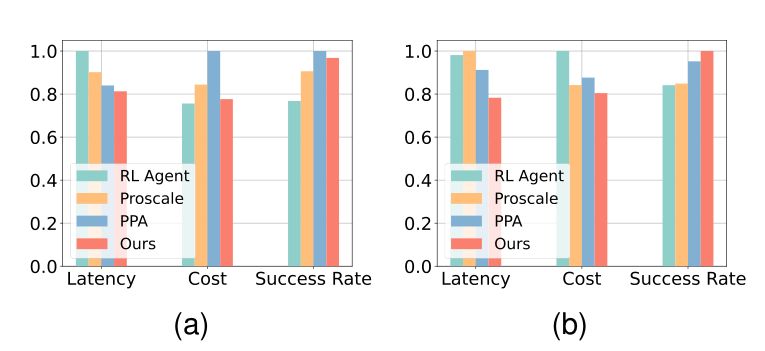
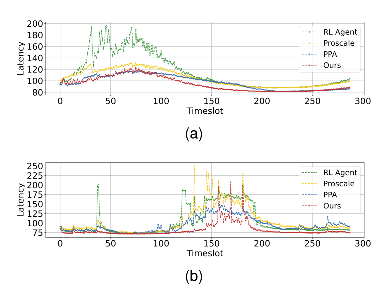
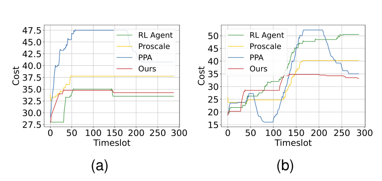
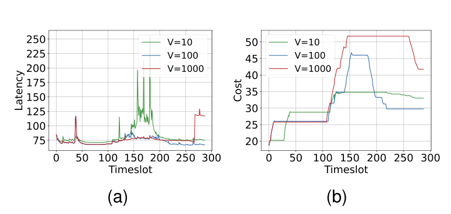

# AutoLFD: A Three-Stage Framework for Microservice Fine-grained Auto-scaling in Edge Server Cluster
Kai Peng , Zhanhao Zhang , Shangwen Zhuang, Jiacheng Wang, Menglan Hu ,
Tianyue Zheng, and Zehui Xiong

## Abstract

The advancement of edge computing and lightweight
containerization technologies has spurred the adoption of the
microservices architecture. However, microservice scheduling in
edge environments faces significant challenges. The first challenge
lies in the tight coupling between microservice deployment and
request routing, which is often overlooked in existing research.
This neglect will lead to the failure to obtain the system optimal
solution. Secondly, user requests in edge environments are highly
unstable and difficult to predict. Existing static or passive scaling
strategies cannot cope with this dynamic nature, resulting in
the increase of user request latency and the decrease of system
resource utilization. Finally, scheduling large-scale microservices
usually incurs high computational overhead, and existing solutions that rely on redeployment are less cost-effective. At the same
time, such methods are also unable to support fast, real-time
adjustment, further limiting their practicality in real-world edge
environments. Therefore, this paper proposes a new three-stage
AutoLFD algorithm to address these challenges. This algorithm
combines Lyapunov optimization, first-fit diminishing (FFD),
and deep reinforcement learning (DRL) to perform fine-grained
auto-scaling of microservices, minimizing user request latency
while keeping system costs within a controllable range. Through
detailed model analysis and strategy design, it jointly optimizes
microservice deployment and request routing to ensure that the
system obtains the optimal solution. Extensive experimental results demonstrate that AutoLFD significantly outperforms stateof-the-art algorithms, achieving substantial reductions in latency
(by 9.86%) and cost (by 8.02%).
**Index Terms:** Microservice auto-scaling, Edge computing,
Lyapunov optimization, Deep reinforcement learning.

## I. Introduction

WITH the rapid proliferation of the Internet of Things
(IoT), and latency-sensitive AI applications [1], traditional cloud-centric architectures are increasingly inadequate
to support the stringent demands of emerging services [2]. To
bridge this gap, edge computing has emerged as a promising
paradigm that brings computation and intelligence closer to
Manuscript received April 19, 2021; revised August 16, 2021.
This work is supported in part by the National Natural Science Foundation
of China under Grant 62171189, and in part by the Key Research and
Development Program of Hubei Province, China under Grants 2024BAA011,
2024BAB016, and 2024BAB031. (Corresponding author: Menglan Hu.)
Kai Peng, Zhanhao Zhang, Shangwen Zhuang, Jiacheng Wang, and
Menglan Hu are with the Hubei Key Laboratory of Internet of Intelligence, School of Electronic Information and Communications, Huazhong
University of Science and Technology, Wuhan 430074, China (e-mail:
pkhust@hust.edu.cn; d202481226@hust.edu.cn; z15078382658@163.com;
w651376825@gmail.com; humenglan@hust.edu.cn;)
Tianyue Zheng is with the School of Computer Science and Engineering,
Southern University of Science and Technology, Shenzhen, China (e-mail:
zhengty@sustech.edu.cn)
Zehui Xiong is with the School of Electronics, Electrical Engineering and
Computer Science, Queen’s University Belfast (e-mail: z.xiong@qub.ac.uk)

data sources [3], [4]. Edge server clusters are widely deployed in urban or industrial environments to provide highperformance and low-latency support for delay-sensitive tasks
[5], [6]. Due to the limited resources of the edge environment,
the traditional monolithic service architecture is no longer applicable. The microservice architecture has gained significant
traction in edge computing scenarios due to its modular and
distributed nature [7].
By decomposing monolithic applications into loosely coupled, independently deployable services, microservices promote scalability, fault isolation, and fine-grained resource management across heterogeneous edge nodes [8], [9]. However,
despite the enormous resource management and scheduling advantages brought about by microservice architecture, orchestrating and scaling microservices in the cluster environment
of edge servers remains a difficult challenge [10]. The highly
dynamic and resource-constrained edge environment, coupled with complex service dependencies and fluctuating user
demands, imposes significant barriers to achieving efficient,
low-latency, and energy-aware microservice management [11],
[12]. These challenges call for adaptive and intelligent orchestration mechanisms to ensure service-level objectives (SLOs)
under strict latency and resource constraints. However, there
are still some limitations in the existing studies [13], [14].
First, due to the limited resources of edge servers, a complete service is hard to execute solely on a single server.
Consequently, a service chain often needs to be decomposed
into multiple microservices, which are then instantiated across
different servers. This results in a complex optimization
problem involving both microservice deployment and request
routing. Moreover, there exists a strong coupling between deployment and routing, the two processes significantly influence
each other. However, most existing studies treat microservice
deployment and request routing as independent optimization
tasks [15]–[17], neglecting their mutual interdependencies.
Optimizing only microservice deployment or request routing
often leads to optimal results in one dimension but creates bottlenecks or inefficiencies in the other dimension. Ultimately,
preventing the global optimal solution of system performance.
Second, user requests in edge environments are dynamic
and difficult to predict [18]. Designing effective strategies
to adapt to such fluctuating demands under constrained edge
resources is a major challenge. Many existing studies optimize
microservice deployment and routing based on the assumption
that the request flow remains static [16], [19]. These static
strategies cannot accommodate dynamic traffic patterns, often
resulting in increased request failures and higher service


latency under long-term traffic fluctuations. Some studies
have considered the dynamic nature of request flows [20].
However, most adopt reactive adjustments that are made only
after the traffic variation occurs. Such reactive strategies are
inherently delayed and can be particularly problematic in
handling chained microservice requests, where the blockage
of a single microservice may lead to system-wide failure.
Finally, balancing operational cost with service quality is
paramount for practical edge service deployment. Service
providers must ensure quality of service (QoS) while maintaining economic viability through efficient resource utilization.
Given the scarcity of edge resources, it is critical to reduce
the number of microservice instances to avoid unnecessary
consumption. Some studies propose re-deployment strategies
to address dynamic request patterns [21], [22]. However,
frequently shutting down and restarting a large number of microservice containers results in significant energy consumption
and high operational costs. Additionally, re-deployment often
incur long scaling times, making the system susceptible to
instability under rapid traffic changes.
Aiming at the above research gaps, this paper aims to
design a better auto-scaling method. However, The following
challenges will be faced in the design process. First, due to the
coupling relationship between microservice deployment and
request routing, it is necessary to reasonably model the system,
decouple them and implement joint optimization to ensure the
optimal solution. Secondly, user requests in edge environments
are complex and difficult to predict. At the same time, it is
important to ensure the stability of the system. Therefore, how
to accurately predict the request arrival rate of the next time
slot and make adjustments in time is a great challenge. Finally,
due to the limited cooling and power resources in the edge
scenario and the strict control of overhead required by most
private server clusters, it is also a challenge to guarantee low
latency levels and QoS at a limited cost.
To this end, in order to address the above challenges and fill
the research gap. This paper proposes an new three-stage algorithm called AutoLFD. This algorithm combines Lyapunov
optimization, first-fit diminishing (FFD), and deep reinforcement learning (DRL) to perform fine-grained auto-scaling of
microservices, minimizing user request latency while keeping
system costs within a controllable range. Through detailed
model analysis and strategy design, it jointly optimizes microservice deployment and request routing to ensure that the
system obtains the optimal solution. In summary, the main
contributions of this paper are as follows:
• This paper introduces the Jcakson queuing theory and
models the process of user requests waiting for microservice instance processing as a queuing system [23].
The entire microservice system is then modeled using
an open Jackson queuing network, integrating queuing
latency, communication latency, and processing latency
to establish a comprehensive analytical model for system
request-response latency.
• This paper proposes a three-stage algorithm, AutoLFD,
to solve this NP-hard problem. First, based on Lyapunov
optimization theory [24], we transform the long-term
stability problem of microservice deployment cost and


request latency into an optimization problem within a
single time slot. Then, based on the FFD method [25], the
MFFD algorithm was designed for the initial deployment
of the microservice system, which was regarded as a
static deployment process. Finally, based on the results
of Lyapunov optimization and DRL, MDRL algorithm
was designed for auto-scaling of microservices.
The organization of this paper is as follows: In Section I,
we introduce the background and contributions of this study.
Section II presents the related work. In Section III, we model
the network and formulate the problem. Section IV provides
a detailed description of our proposed algorithm. Section V
comprehensively presents the experimental results. Finally,
Section VI concludes the paper.
## II. Related Work
### A. Service Deployment
Research on microservice deployment focuses on efficiently placing loosely coupled but interdependent services
on appropriate nodes to ensure system stability and operational efficiency. Wang et al. [26] studied resource allocation
in cloud-edge collaborative environments under SLOs constraints, proposing a linear programming-based approximation
algorithm to determine the optimal number of instances per
server. Yang et al. [27] modeled the service function chain
(SFC) deployment problem as a mixed integer nonlinear
programming (MINLP) formulation and applied reinforcement
learning for latency-sensitive scheduling. Li et al. [28] developed MOTAS, a scheduling framework that considers both
microservice dependencies and cluster relationships, using a
recursive graph mapping heuristic for cloud deployment. To
enhance scalability, Liu et al. [29] proposed a multiobjective
evolutionary algorithm for heterogeneous server clusters. Lv
et al. [30] introduced GRLD, a graph reinforcement learningbased framework that reduces overhead while satisfying QoS
constraints. However, these studies often ignore the impact
of deployment strategies on request routing, and thus fail to
achieve good results.
### B. Request Routing
Microservices are often deployed across distributed environments with complex dependencies, leading to multiple
routing options with varying latencies. The key challenge lies
in minimizing average response time while balancing loads.
Bhattacharya et al. [31] proposed BLOC, which balances
load by analyzing system resource usage. Bachar et al. [32]
designed MCOSS, adjusting load balancing weights using
multi-cluster demand information. Wang et al. [33] formulated
routing as a many-to-one matching game and proposed DDADQ, a dependency-aware algorithm with dynamic quotas.
Zhao et al. [34] introduced a redundancy placement framework
using sample average approximation to enhance responsiveness. However, most approaches ignoring its dependency on
deployment decisions, which limits their effectiveness in highconcurrency scenarios.


### C. Joint Service Deployment and Request Routing
Deployment and routing are tightly interdependent placement decisions affect routing feasibility, while routing impacts
instance loads. To address this, recent work explores joint
optimization. Ren et al. [35] proposed JSORD, a mixed integer linear programming-based orchestration and scheduling
mechanism. Mao et al. [36] presented a traffic-aware framework combining dynamic segmentation and nearest-neighbor
routing. Hu et al. [37] designed a two-stage heuristic with
greedy deployment and request-matching partition mapping.
Peng et al. [38] proposed a 2-approximation algorithm using
rounding for deployment and routing in mobile edge environments. Nevertheless, most methods rely on simplified queueing
models like M/M/1 and assume static loads, limiting their
adaptability to real-world, dynamic conditions.
### D. Auto-scaling under Dynamic Load
To maintain performance under fluctuating workloads, microservice systems require timely resource scaling or migration. Some studies focus on instance migration. Zeng et al. [39]
proposed ADVMC, a VM consolidation framework using deep
reinforcement learning and host overload evaluation to reduce
energy consumption. Liu et al. [40] presented E2MS, a migration strategy for dynamic manufacturing environments. However, these works often neglect broader scheduling constraints.
Others target elastic scaling. Kardani et al. [41] introduced
ADRL, which integrates anomaly detection and reinforcement
learning for adaptive scaling. Rossi et al. [42] developed a
scaling framework using dynamic thresholds, while Cheng et
al. [43] proposed ProScale, leveraging workload prediction for
cloud-edge collaboration. Still, most methods treat scaling and
migration separately, lacking unified strategies for dynamic
load balancing.


**Table I. Common Symbols and Variables**

| Notation | Description |
|---|---|
| $S$ | Collection of data center servers |
| $M$ | Collection of microservices |
| $R$ | Collection of user request streams |
| $T_0$ | Fixed communication latency between servers |
| $T_{max}$ | Request response time limit |
| $CR_s$ | CPU resources owned by server $s$ |
| $MR_s$ | Memory resources owned by server $s$ |
| $CR_m$ | CPU resources required to deploy microservice $m$ |
| $MR_m$ | Memory resources required to deploy microservice $m$ |
| $\mu_m$ | Request processing rate of microservice $m$ instances |
| $T^{que}$ | Request queuing latency |
| $T^{pro}$ | Request processing latency |
| $T^{com}$ | Request communication latency |
| $T_G$ | Average request latency for a microservice graph |
| $c(\cdot)$ | Total cost function |
| $\tilde{C}$ | Average cost estimate specified by the service provider |
| $N_m$ | Number of microservices |
| $N_s$ | Number of servers |
| $N_{mchange}$ | Number of changed microservice instances |
| $N_{schange}$ | Number of changed servers |
| $L(\cdot)$ | Lyapunov function |
| $Q(\cdot)$ | Lyapunov virtual queue |
| $\Delta(\cdot)$ | Lyapunov drift function |
| $D(\cdot)$ | Optimal elastic resource scheduling scheme |


## III. System Model

In this section, we mathematically model the problem, and the commonly used notations are shown in Table I.

### A. Network Model

This paper focuses on edge server clusters, whose hardware infrastructure consists of a series of multi-core servers. The communication latency between two cores on the same server is assumed to be negligible. Different servers within the edge server cluster are assumed to be mutually connected with sufficient network bandwidth. Therefore, the communication latency between different servers is regarded as identical and denoted by $T_0$.

The network is modeled as $G=(S,L)$, where $S=\{s_1,s_2,\ldots,s_k,\ldots,s_{|S|}\}$ represents the set of servers and $L$ denotes the set of links connecting these servers. The parameter $CR_s$ denotes the CPU resources available on server $s$, while $MR_s$ represents the available memory resources on server $s$. Since different microservice instances require different processing times, $\mu_m$ denotes the processing capability of a CPU core when executing microservice instance $m$.

When a user request reaches the system, it is processed sequentially by a set of specific microservices. We define $M=\{m_1,m_2,\ldots,m_j,\ldots,m_{|M|}\}$ as the set of all microservices. Fig. 1 illustrates a typical online shopping scenario and its decomposition into microservice invocation chains.



*Fig. 1. Illustration of the microservice workflow and request splitting.*

Each microservice $m_j$ may have multiple container images that can be deployed on a single server or distributed across multiple servers. Multiple identical instances of the same microservice can be deployed on the same server to improve request processing capability. Let $CR_{m_j}$ and $MR_{m_j}$ denote the CPU and memory resources required to deploy microservice $m_j$, respectively, and let $N_{s_i}(m_j)$ denote the number of instances of microservice $m_j$ deployed on server $s_i$. The following resource constraints must be satisfied:

$$
\forall s_i \in S,\quad \sum_{1\le j\le |M|} N_{s_i}(m_j)\times CR_{m_j}\le CR_{s_i}.
\tag{1}
$$

$$
\forall s_i \in S,\quad \sum_{1\le j\le |M|} N_{s_i}(m_j)\times MR_{m_j}\le MR_{s_i}.
\tag{2}
$$

### B. Request Routing

Internet applications commonly offer various services, such as payment, downloading, and searching. When multiple users request the same service, similar requests continuously arrive in the system, forming a request stream $R_i$. Upon reaching the edge server, the request flow is routed to an instance of the corresponding entry microservice. If the instance is idle, it processes the request immediately; otherwise, the request is placed into the instance waiting queue. Once the current microservice instance completes the request, it triggers the invocation of the next microservice in the chain until the entire request flow is completed.

This paper assumes that the arrival of each request flow $R_i$ follows a Poisson distribution with an arrival rate $\lambda_{R_i}$. Each request flow is associated with a maximum allowable latency, denoted by $T_{\max}$, such that a request is considered successful if the elapsed time from initiation to response is less than $T_{\max}$; otherwise, it is considered failed. Based on these assumptions, the process is modeled using an open Jackson queuing network.



*Fig. 2. Illustration of microservice instance deployment and request routing.*

Fig. 2 shows five types of microservices deployed across an edge server cluster. Three request flows are considered: $R_1=\{m_4,m_1,m_5,m_2\}$, $R_2=\{m_1,m_3,m_4,m_2\}$, and $R_3=\{m_5,m_4,m_1,m_3\}$. A probabilistic routing strategy is adopted to determine both the initial server and subsequent hop selections for each microservice invocation. The probability that server $s_k$ is selected to process microservice $m_j$ is defined as:

$$
P_{m_j}(s_k)=\frac{N_{s_k}(m_j)}{\sum_{s\in S}N_s(m_j)}.
\tag{3}
$$

where $P_{m_j}(s_k)$ denotes the probability that server $s_k$ processes a request for microservice $m_j$, and $N_{s_k}(m_j)$ represents the number of instances of $m_j$ deployed on $s_k$. This probability satisfies the following constraint:

$$
\sum_{m\in M} P_{m_j}(s_k)=1.
\tag{4}
$$

Since each request stream follows a Poisson process, and due to the additive property of Poisson processes, the aggregate request flow at a server also follows a Poisson distribution. When multiple instances of the same microservice are deployed on a server, the system can be modeled as an $M/M/C$ queuing system, where $C$ denotes the total number of deployed instances of the microservice. The service intensity $\rho_m$ of this queuing system is defined as:

$$
\rho_m=\frac{\lambda_m}{c_m\mu_m},\quad \forall m\in M.
\tag{5}
$$

where $\mu_m$ denotes the service rate of a single instance of microservice $m$. For system stability, it is required that $\rho_m<1$. In a stable system, the average number of queued requests for microservice $m$ is denoted by $L_m$ and is calculated as:

$$
L_m=\frac{1}{c_m!}\left(\frac{\lambda_m}{c_m\mu_m}\right)\frac{\rho_m}{(1-\rho_m)^2}P_m^0,\quad \forall m\in M.
\tag{6}
$$

where $P_m^0$ is the steady-state probability that no requests are in the system, computed as:

$$
P_m^0=\left[\sum_{i=0}^{c_m-1}\frac{1}{i!}\left(\frac{\lambda_m}{c_m\mu_m}\right)+\frac{1}{c_m!}\frac{1}{1-\rho_m}\left(\frac{\lambda_m}{c_m\mu_m}\right)^{c_m}\right]^{-1}.
\tag{7}
$$

Due to the complexity of microservice interactions, a given request type may traverse multiple routing paths, each incurring different end-to-end latencies. Let $M_r$ denote the microservice invocation sequence corresponding to request flow $R_i$, and let the set of all feasible routing paths for $R_i$ be denoted as $G_{R_i}=\{g_1,g_2,\ldots,g_{|G_{R_i}|}\}$. Each routing path $g_k$ has an associated probability $P(g_k)$ representing the likelihood that $R_i$ follows this path:

$$
P(g_k)=\prod_{m_j\in M_r}P_{m_j}(s_k).
\tag{8}
$$

and satisfies the normalization condition:

$$
\sum_{g_k\in G_{R_i}}P(g_k)=1.
\tag{9}
$$

The total response latency of a request flow consists of three components: queuing latency, processing latency, and communication latency.

**Queuing latency.** The average queuing latency of microservice $m$ is denoted by $t_m^{que}$ and is calculated as:

$$
t_m^{que}=\frac{L_m}{\lambda_m}=\frac{1}{\lambda_m c_m!}\left(\frac{\lambda_m}{c_m\mu_m}\right)\frac{\rho_m}{(1-\rho_m)^2}P_m^0.
\tag{10}
$$

Thus, the average queuing latency for a request flow $R_i$ along a specific routing path is:

$$
T^{que}=\sum_{m\in M_r}t_m^{que}.
\tag{11}
$$

**Processing latency.** The processing latency of microservice $m$ is denoted by $t_m^{pro}$ and is calculated as:

$$
t_m^{pro}=\frac{1}{\mu_m}.
\tag{12}
$$

For the same request flow, the sequence of microservices passed through any routing path is the same, so the average processing latency of any routing path is:

$$
T^{pro}=\sum_{m\in M_r}t_m^{pro}.
\tag{13}
$$

**Communication latency.** The communication latency between microservice $m$ and its predecessor microservice on a routing path is denoted by $t_m^{com}$ and is computed as:

$$
t_m^{com}=flag(m)\times T_0.
\tag{14}
$$

where $flag(m)$ is a binary variable indicating whether the subsequent microservice of $m$ is deployed on a different server. If the microservice is deployed on the same server, $flag(m)=0$; otherwise, $flag(m)=1$. Thus, the total transmission latency for a request flow $R_i$ along a routing path is:

$$
T^{com}=\sum_{m\in M_r}t_m^{com}.
\tag{15}
$$

Based on the above definitions, the total response latency $T_{i,k}$ for a request flow $R_i$ along a specific routing path $g_k$ is:

$$
T_{i,k}=T^{que}+T^{pro}+T^{com}.
\tag{16}
$$

Using the probability of each path as the weighting coefficient, the average request response latency $T_i$ of the request flow in all routing paths can be obtained as:

$$
T_i=\sum_{g_k\in G_{R_i}}P(g_k)\times T_{i,k}.
\tag{17}
$$

Finally, a weighted coefficient $\phi_i$ is defined according to the importance of each request flow $R_i$. After the weighted average, the average request-response latency of the whole microservice graph is:

$$
T_G=\sum_{R_i}\phi_iT_i.
\tag{18}
$$

### C. Initial System Optimization Goal

Auto-scaling of microservices is a long-term challenge where the objective is to ensure cost-efficient system operation while maintaining high QoS over time. The total cost considered in this work consists of two components.

The first component is the running cost, denoted by $c_1(t)$, which is directly related to the number of deployed microservice instances $N_m(t)$ and the number of active servers $N_s(t)$:

$$
c_1(t)=\alpha\cdot N_m(t)+\beta\cdot N_s(t).
\tag{19}
$$

where $\alpha$ denotes the resource cost of operating a single microservice instance, and $\beta$ represents the resource cost of operating a single server.

The second component is the resource scheduling cost, primarily incurred by the deployment or removal of microservice instances and the activation or deactivation of servers:

$$
c_2(t)=\gamma\cdot N_{mc}(t)+\rho\cdot N_{sc}(t).
\tag{20}
$$

where $\gamma$ denotes the cost of deploying or removing a single microservice instance, and $\rho$ represents the overhead associated with activating or deactivating a server. Consequently, the total cost at time slot $t$ is:

$$
c(t)=\omega_1\cdot c_1(t)+\omega_2\cdot c_2(t).
\tag{21}
$$

Let $\tilde{C}$ denote the long-term time-averaged cost budget specified by the service provider. The total cost must satisfy:

$$
\lim_{T\to\infty}\frac{1}{T}\sum_{t=0}^{T-1}\mathbb{E}[c(t)]\le\tilde{C}.
\tag{22}
$$

Based on the above definitions, the elastic resource scheduling problem under dynamic system load is formulated as optimization problem $P1$:

$$
\min\ T_G(t)
\tag{23}
$$

subject to the constraints in Eqs. (1), (2), and (22).

## IV. Algorithm

In this section, we elaborate on the proposed algorithm. The system timeline is discretized into fixed-length time slots of 5 minutes each, yielding 288 time slots over a 24-hour period. The arrival rate of user requests changes dynamically in different time slots. The proposed AutoLFD algorithm consists of three phases.

### A. Problem Transformation via Lyapunov Optimization

Given that problem $P1$ is formulated as a time-averaged optimization problem, Lyapunov optimization theory is used to transform it into a per-slot optimization problem by introducing a virtual queue. The virtual queue $Q(t)$ monitors the cumulative deviation of the actual cost from the budget constraint and is updated in each time slot as:

$$
Q(t+1)=\max\left\{Q(t)+c(t)-\tilde{C},0\right\}.
\tag{24}
$$

where $Q(0)=0$. If the virtual queue satisfies mean rate stability, then:

$$
\lim_{T\to\infty}\frac{\mathbb{E}[Q(T)]}{T}=0.
\tag{25}
$$

**Lemma 1.** If the virtual queue $Q(t)$ satisfies Eq. (25), then the time-average constraint of the total cost in Eq. (22) is also satisfied.

From Eq. (24), we have:

$$
Q(t+1)\ge Q(t)+c(t)-\tilde{C}.
\tag{26}
$$

Subtracting $Q(t)$ from both sides and summing over all time slots $t\in\{0,1,\ldots,T-1\}$ yields:

$$
Q(T)-Q(0)=Q(T)\ge\sum_{t=0}^{T-1}c(t)-\sum_{t=0}^{T-1}\tilde{C}.
\tag{27}
$$

Dividing both sides by $T$ and rearranging terms gives:

$$
\frac{1}{T}\sum_{t=0}^{T-1}c(t)\le\frac{Q(T)}{T}+\frac{1}{T}\sum_{t=0}^{T-1}\tilde{C}.
\tag{28}
$$

Taking expectations on both sides and letting $T\to\infty$, we obtain:

$$
\lim_{T\to\infty}\frac{1}{T}\sum_{t=0}^{T-1}\mathbb{E}[c(t)]\le \lim_{T\to\infty}\frac{\mathbb{E}[Q(T)]}{T}+\tilde{C}.
\tag{29}
$$

When the virtual queue $Q(t)$ achieves mean rate stability, Eq. (25) holds, which leads to:

$$
\lim_{T\to\infty}\frac{1}{T}\sum_{t=0}^{T-1}\mathbb{E}[c(t)]\le\tilde{C}.
\tag{30}
$$

The Lyapunov function is introduced as:

$$
L(t)=\frac{1}{2}Q(t)^2.
\tag{31}
$$

Then, the Lyapunov drift is defined as:

$$
\Delta(t)=\mathbb{E}\left[L(t+1)-L(t)\mid Q(t)\right].
\tag{32}
$$

**Lemma 2.** There exists an upper bound on the Lyapunov drift:

$$
\Delta(t)\le\delta+\mathbb{E}\left[Q(t)(c(t)-\tilde{C})\mid Q(t)\right].
\tag{33}
$$

From Eqs. (31) and (32), we have:

$$
\Delta(t)=\frac{1}{2}\mathbb{E}\left[Q(t+1)^2-Q(t)^2\mid Q(t)\right].
\tag{34}
$$

From Eq. (24), we obtain:

$$
\begin{aligned}
Q(t+1)^2
&=\left\{\max\left[Q(t)+c(t)-\tilde{C},0\right]\right\}^2 \\
&\le Q(t)^2+\left(c(t)-\tilde{C}\right)^2+2Q(t)\left(c(t)-\tilde{C}\right).
\end{aligned}
\tag{35}
$$

Substituting Eq. (35) into Eq. (34) yields:

$$
\begin{aligned}
\Delta(t)
&\le \frac{1}{2}\mathbb{E}\left[\left(c(t)-\tilde{C}\right)^2+2Q(t)\left(c(t)-\tilde{C}\right)\mid Q(t)\right] \\
&=\frac{1}{2}\mathbb{E}\left[\left(c(t)-\tilde{C}\right)^2\mid Q(t)\right]
+\mathbb{E}\left[Q(t)(c(t)-\tilde{C})\mid Q(t)\right].
\end{aligned}
\tag{36}
$$

From Eqs. (19), (20), and (21), we have:

$$
c(t)=\omega_1\cdot\left(\alpha\cdot N_m(t)+\beta\cdot N_s(t)\right)+\omega_2\cdot\left(\gamma\cdot N_{mc}(t)+\rho\cdot N_{sc}(t)\right).
\tag{37}
$$

Here, $N_m(t)$, $N_s(t)$, $N_{mc}(t)$, and $N_{sc}(t)$ denote the number of microservices, servers, changed microservice instances, and changed servers at time slot $t$, respectively. These variables are bounded above by their maximum values. Accordingly, Eq. (36) can be relaxed as:

$$
\Delta(t)\le\delta+\mathbb{E}\left[Q(t)\left(c(t)-\tilde{C}\right)\mid Q(t)\right].
\tag{38}
$$

where

$$
\delta=\frac{1}{2}\left(\omega_1\cdot\left(\alpha\cdot N_m^{\max}+\beta\cdot N_s^{\max}\right)+\omega_2\cdot\left(\gamma\cdot N_{mc}^{\max}+\rho\cdot N_{sc}^{\max}\right)-\tilde{C}\right)^2.
$$

To maintain the stability of the virtual queue while minimizing the average response time, a control parameter $V$ is introduced to balance the trade-off between these two components. The drift-plus-penalty function for each time slot is defined as:

$$
\Delta(t)+V\cdot\mathbb{E}\left[T_G(t)\mid Q(t)\right].
\tag{39}
$$

Applying Lemma 2, we obtain:

$$
\begin{aligned}
\Delta(t)+V\cdot\mathbb{E}\left[T_G(t)\mid Q(t)\right]
&\le \beta+\mathbb{E}\left[Q(t)(c(t)-\tilde{C})\mid Q(t)\right] \\
&\quad +V\cdot\mathbb{E}\left[T_G(t)\mid Q(t)\right].
\end{aligned}
\tag{40}
$$

Following Lyapunov optimization, the original problem is transformed into minimizing the upper bound in Eq. (40), leading to:

$$
\min\left(\beta-\mathbb{E}\left[Q(t)\cdot\tilde{C}\mid Q(t)\right]+\mathbb{E}\left[Q(t)c(t)+V\cdot T_G(t)\mid Q(t)\right]\right).
\tag{41}
$$

The original long-term optimization problem $P1$ is reformulated as a per-slot decision-making problem $P2$:

$$
\min_{D(t)}\mathbb{E}\left[Q(t)c(t)+V\cdot T_G(t)\mid Q(t)\right].
\tag{42}
$$

subject to the constraints in Eqs. (1) and (2). To simplify computation, the conditional expectation can be transformed into the unconditional expectation. The simplified form is:

$$
\min_{D(t)}\left[Q(t)c(t)+V\cdot T_G(t)\right].
\tag{43}
$$

subject to the constraints in Eqs. (1) and (2).

### B. MFFD for Initial Solution Construction

At the beginning of the system, microservice instances need to be deployed for the first time. This paper assumes that the initial request flow is known in advance. MFFD is designed based on the FFD algorithm to perform the initial deployment of microservice instances. The required number of instances is calculated as:

$$
num_m=\left\lceil (1+\epsilon)\cdot\frac{\lambda}{\mu}\right\rceil.
\tag{44}
$$

where $\lceil\cdot\rceil$ denotes the ceiling function, and $\epsilon$ represents the excess margin, set to 0.1 in this experiment.

**Algorithm 1. MFFD**

```text
Input:  M; S; CR_s; MR_s; CR_m; MR_m; lambda; epsilon
Output: Initial microservice deployment scheme s_0
1:  Sort microservices in M by CR_m and MR_m in descending order
2:  for each microservice m in M do
3:      Compute required instances: num_m
4:      for each server s in S do
5:          Determine available capacity c_s on node s
6:          c_s = min{ floor(CR_m / CR_s), floor(MR_m / MR_s) }
7:          Deploy min(c_s, num_m) instances of m on node s
8:          Update server CR_s and MR_s
9:          if CR_s < CR_m or MR_s < MR_m then
10:             break
11:         end if
12:     end for
13: end for
14: Return deployment scheme s_0
```

### C. MDRL for Microservice Auto-scaling

This paper uses a DRL method based on proximal policy optimization (PPO), and combines the results of Lyapunov optimization to design the MDRL algorithm. The overall structure is illustrated in Fig. 3.



*Fig. 3. MDRL algorithm structure diagram.*

The core algorithm adopts an actor-critic architecture, primarily consisting of a deep neural network, an actor network, and a critic network. The algorithm predicts the request arrival rate for the next time slot. The action to be executed in the next time slot is determined during the current time slot and applied once the next time slot begins.

The state space is defined as:

$$
State=\left\{r_{MR},r_{CR},C_m,R_{his}\right\}.
\tag{45}
$$

where $r_{MR}$ denotes the remaining memory of each server, $r_{CR}$ represents the remaining CPU capacity, $C_m$ indicates the currently deployed microservices and their quantities on each server, and $R_{his}$ is the historical record of request arrival rates.

The action space is defined as:

$$
Action=\left\{s_i,m_j,N_{change}\right\}.
\tag{46}
$$

where $s_i$ is the selected server, $m_j$ is the selected microservice type, and $N_{change}$ represents the change in the number of instances of $m_j$, ranging from -3 to 3. Fig. 4 illustrates the instance scaling process.



*Fig. 4. Illustration of the instance scaling.*

The reward function is defined based on the result of Lyapunov optimization:

$$
Reward=-\left[Q(t)c(t)+V\cdot T_G(t)\right].
\tag{47}
$$

**Algorithm 2. MDRL**

```text
Input:  Initial environment s_0; learning rate eta; discount factor gamma;
        GAE parameter lambda_hat; clipping coefficient epsilon;
        loss coefficients phi_1, phi_2, phi_3; iterations K;
        training epochs E; update epochs N
1:  Initialize Actor-Critic network
2:  Initialize optimizer with learning rate eta
3:  for iteration = 1 to K + 1 do
4:      Reset environments and get initial observation s_0
5:      for step = 0 to E - 1 do
6:          Select action a_t ~ pi_theta(a_t | s_t) using Actor network
7:          Get value function V(s_t) using Critic network
8:          Execute a_t, get reward r_t
9:          Update observation to s_{t+1}
10:         Compute TD error delta_t
11:         Compute advantage function A_t via GAE(gamma, lambda_hat)
12:         Compute returns G_t
13:         for epoch = 1 to N do
14:             for each minibatch do
15:                 Compute policy loss, value loss, and entropy loss
16:                 Compute total loss L
17:                 Update theta via gradient ascent with grad_theta L
18:             end for
19:         end for
20:     end for
21:     Update learning rate if using scheduler
22:     Log training metrics and save model checkpoints
23: end for
```

During training, the agent observes the current state $s_t$, uses the actor network to generate a probability distribution $\pi(a_t|s_t)$, samples an action $a_t$, and uses the critic network to estimate the value function $V(s_t)$. After executing the action, the agent transitions to a new state $s_{t+1}$ and receives a reward $r_t$.

The generalized advantage estimation method is employed to compute the advantage function:

$$
A_t=\delta_t+\gamma\hat{\lambda}A_{t+1}.
\tag{48}
$$

where $\gamma$ is the discount factor, and $\hat{\lambda}$ is the GAE decay parameter. The temporal-difference error is:

$$
\delta_t=r_t+\gamma V(s_{t+1})-V(s_t).
\tag{49}
$$

The return $G_t$ is computed as:

$$
G_t=A_t+V(s_t).
\tag{50}
$$

The policy loss is defined as:

$$
L^{policy}=\mathbb{E}_t\left[\min\left(r_t(\theta)A_t,\operatorname{clip}(r_t(\theta),1-\epsilon,1+\epsilon)A_t\right)\right].
\tag{51}
$$

where

$$
r_t(\theta)=\frac{\pi_\theta(a_t|s_t)}{\pi_{\theta_{old}}(a_t|s_t)}.
$$

The entropy loss is computed as:

$$
L^{entropy}=-\mathbb{E}_t\left[\pi_\theta(a_t|s_t)\log\pi_\theta(a_t|s_t)\right].
\tag{52}
$$

The value loss updates the critic network by minimizing the mean squared error between the predicted value and the actual return:

$$
L^{value}=\frac{1}{2}\mathbb{E}_t\left[(V(s_t)-G_t)^2\right].
\tag{53}
$$

The overall loss function is the weighted sum of the three loss terms:

$$
L=\phi_1L^{policy}+\phi_2L^{entropy}+\phi_3L^{value}.
\tag{54}
$$

where $\phi_1$, $\phi_2$, and $\phi_3$ are the coefficients corresponding to the policy, entropy, and value loss components, respectively.

## V. Experiments

### A. Experimental Setup

The experiment is based on the Social Network microservice application from the DeathStar dataset. The experimental setup includes ten server nodes and ten types of user request flows. Two types of load fluctuation patterns are considered. The overall request arrival rate varies according to the selected load curve, with different random perturbations applied to each individual request stream. The aggregate system load variation is illustrated in Fig. 5.

For the sinusoidal load variation model, a sine function is used to simulate the variation in system load, with one full sine cycle corresponding to a single day:

$$
\lambda_i(t)=a+b\sin\left(\frac{2\pi t}{T_1}\right)+n_i.
\tag{55}
$$

where $\lambda_i(t)$ represents the variation in request arrival rate over time, $a=15$, $b=10$, and $T_1=288$. The term $n_i$ is a random disturbance within the range $[-5,5]$.

For the Twitter load variation model, the load change data of the Twitter application system on November 1, 2022, is used as experimental data, and the load change law is retained through mathematical transformations to keep the obtained system load within the affordable range of the experimental microservice system.



*Fig. 5. Request load dynamic change curve.*

The comparison algorithms include PPA, ProScale, and RL agent. The evaluation indexes include average request latency, cost, and request success rate.

### B. Experimental Results

Fig. 6 presents the training convergence curve. The proposed algorithm exhibits consistent and stable convergence once training progresses beyond 1,000 iterations, which validates the soundness and effectiveness of the reward function design.



*Fig. 6. Training convergence curve.*

Fig. 7 presents the average performance of the proposed algorithm across three metrics: request latency, cost, and request success rate. All metric values are normalized to the range $[0,1]$.



*Fig. 7. Request latency, cost and request success rate averaged over the course of a day for two load variation curves. (a) Sin variation curve. (b) Twitter variation curve.*

Under the Sin load variation curve, the proposed algorithm improves request latency, cost, and success rate by 9.86%, 8.02%, and 6.85%, respectively, compared with the best-performing ProScale algorithm. Under the Twitter load variation curve, the proposed algorithm achieves improvements of 21.72%, 4.47%, and 17.85% across the same three metrics.

Fig. 8 illustrates the time-slot variation in request latency under the two load variation curves. When the request arrival rate is low, the average request latency remains low. As the arrival rate increases, the agent selects appropriate microservice instances for scaling, thereby maintaining request latency stability.



*Fig. 8. Time slot variation of request latency under two load variation curves. (a) Sin variation curve. (b) Twitter variation curve.*

Fig. 9 depicts the time-slot variation in cost under the two load variation curves. Due to the stabilizing effect of Lyapunov optimization on the virtual queue, the cost fluctuates around the average budget $\tilde{C}$. In this experiment, $\tilde{C}$ is set to 35.



*Fig. 9. Time slot variation of cost under two load variation curves. (a) Sin variation curve. (b) Twitter variation curve.*

The $V$ parameter in Lyapunov optimization balances system cost and user request latency. As shown in Fig. 10, increasing $V$ makes request latency weigh more heavily in the reward function. Consequently, user request latency decreases, while the associated cost increases. When $V=1000$, the cost begins to drop rapidly near the end of the time slot because the accumulated virtual queue $Q(t)$ makes the cost term comparable to the latency component.



*Fig. 10. Impact of V-parameters on request latency and cost. (a) Impact of V-parameters on request latency. (b) Impact of V-parameters on cost.*

## VI. Conclusions
In this paper, we address the problem of dynamically
changing user requests in edge server clusters and first model
the problem using queuing theory. We proposed a three
steps AutoLFD algorithm to solve the problem. Extensive
simulation experiments demonstrate that our methods significantly improves user request latency, system operation cost,
and other performance metrics compared to current state-ofthe-art methods. The proposed approach ensures maximum
improvement in user service quality while keeping system
operation costs below the predefined budget. This work provides a valuable reference for solving microservice scheduling
problems in both edge and cloud computing environments.
With the rapid advancement of reinforcement learning, its
suitability for dynamically changing environments makes it
particularly well suited for scenarios involving fluctuating user
requests. This paper represents an initial attempt to apply
reinforcement learning to microservice auto-scaling. Future
research can further explore more effective designs of the
reward function and action space. Additionally, while this
study adopts a single-agent framework, employing a multiagent approach in future work may introduce higher resource
consumption but holds promise for achieving better overall
performance.
## References
[1] S. Jhingran, N. Bansal, R. Chaturvedi, A. Singh, and Y. Arora, “Decentralized generative ai model deployment using microservices,” in
2024 International Conference on Artificial Intelligence and Quantum
Computation-Based Sensor Application (ICAIQSA). IEEE, 2024, pp.
1–5.
[2] K. Peng, Y. Hu, H. Ding, H. Chen, L. Wang, C. Cai, and M. Hu, “Largescale service mesh orchestration with probabilistic routing in cloud data
centers,” IEEE Transactions on Services Computing, 2025.
[3] Q. Luo, S. Hu, C. Li, G. Li, and W. Shi, “Resource scheduling in
edge computing: A survey,” IEEE communications surveys & tutorials,
vol. 23, no. 4, pp. 2131–2165, 2021.
[4] X. Kong, Y. Wu, H. Wang, and F. Xia, “Edge computing for internet of
everything: A survey,” IEEE Internet of Things Journal, vol. 9, no. 23,
pp. 23 472–23 485, 2022.
[5] P. Hou, H. Jia, H. Zhu, Z. Lu, S.-C. Huang, Y. Yang, and H. Chai,
“Efficient edge server activation and service association for green
computing in mec-enabled internet of vehicles,” IEEE Transactions on
Intelligent Vehicles, 2024.
[6] F. Gou and J. Wu, “Optimization of edge server group collaboration
architecture strategy in iot smart cities application,” Peer-to-Peer Networking and Applications, vol. 17, no. 5, pp. 3110–3132, 2024.
[7] V. Velepucha and P. Flores, “A survey on microservices architecture:
Principles, patterns and migration challenges,” IEEE access, vol. 11,
pp. 88 339–88 358, 2023.
[8] L. De Lauretis, “From monolithic architecture to microservices architecture,” in 2019 IEEE International Symposium on Software Reliability
Engineering Workshops (ISSREW). IEEE, 2019, pp. 93–96.
[9] Y. Abgaz, A. McCarren, P. Elger, D. Solan, N. Lapuz, M. Bivol,
G. Jackson, M. Yilmaz, J. Buckley, and P. Clarke, “Decomposition
of monolith applications into microservices architectures: A systematic
review,” IEEE Transactions on Software Engineering, vol. 49, no. 8, pp.
4213–4242, 2023.


[10] M. Söylemez, B. Tekinerdogan, and A. Kolukısa Tarhan, “Challenges
and solution directions of microservice architectures: A systematic
literature review,” Applied sciences, vol. 12, no. 11, p. 5507, 2022.
[11] M. D. Hossain, T. Sultana, S. Akhter, M. I. Hossain, N. T. Thu, L. N.
Huynh, G.-W. Lee, and E.-N. Huh, “The role of microservice approach
in edge computing: Opportunities, challenges, and research directions,”
ICT Express, vol. 9, no. 6, pp. 1162–1182, 2023.
[12] W. Lv, Q. Wang, P. Yang, Y. Ding, B. Yi, Z. Wang, and C. Lin,
“Microservice deployment in edge computing based on deep q learning,”
IEEE Transactions on Parallel and Distributed Systems, vol. 33, no. 11,
pp. 2968–2978, 2022.
[13] J. Lu, W. Li, J. Guo, X. Ding, Z. Tang, and T. Wang, “Container scheduling with dynamic computing resource for microservice deployment in
edge computing,” in 2024 20th International Conference on Mobility,
Sensing and Networking (MSN). IEEE Computer Society, 2024, pp.
236–243.
[14] T. Pusztai, S. Nastic, A. Morichetta, V. C. Pujol, P. Raith, S. Dustdar,
D. Vij, Y. Xiong, and Z. Zhang, “Polaris scheduler: Slo-and topologyaware microservices scheduling at the edge,” in 2022 IEEE/ACM 15th
International Conference on Utility and Cloud Computing (UCC).
IEEE, 2022, pp. 61–70.
[15] X. He, Z. Tu, M. Wagner, X. Xu, and Z. Wang, “Online deployment
algorithms for microservice systems with complex dependencies,” IEEE
Transactions on Cloud Computing, vol. 11, no. 2, pp. 1746–1763, 2022.
[16] Y. Wang, C. Zhao, S. Yang, X. Ren, L. Wang, P. Zhao, and X. Yang,
“Mpcsm: Microservice placement for edge-cloud collaborative smart
manufacturing,” IEEE Transactions on Industrial Informatics, vol. 17,
no. 9, pp. 5898–5908, 2020.
[17] C. Meng, S. Song, H. Tong, M. Pan, and Y. Yu, “Deepscaler: Holistic
autoscaling for microservices based on spatiotemporal gnn with adaptive
graph learning,” in 2023 38th IEEE/ACM International Conference on
Automated Software Engineering (ASE). IEEE, 2023, pp. 53–65.
[18] L. Wang, X. Liu, H. Ding, Y. Hu, K. Peng, and M. Hu, “Energydelay-aware joint microservice deployment and request routing with
dvfs in edge: A reinforcement learning approach,” IEEE Transactions
on Computers, 2025.
[19] K. Peng, J. He, J. Guo, Y. Liu, J. He, W. Liu, and M. Hu, “Delayaware optimization of fine-grained microservice deployment and routing
in edge via reinforcement learning,” IEEE Transactions on Network
Science and Engineering, 2024.
[20] R. Zeng and Y. Chen, “A novel automatic horizontal extension technology for multi-instance microservice system,” in 2024 International
Conference on Networking and Network Applications (NaNA). IEEE,
2024, pp. 282–286.
[21] K. Cheng, S. Zhang, M. Liu, Y. Gu, L. Wei, H. Cheng, K. Liu, Y. Song,
X. Shi, A. Zhu et al., “Geoscale: microservice autoscaling with cost
budget in geo-distributed edge clouds,” IEEE Transactions on Parallel
and Distributed Systems, vol. 35, no. 4, pp. 646–662, 2024.
[22] H. Ahmad, C. Treude, M. Wagner, and C. Szabo, “Smart hpa: A
resource-efficient horizontal pod auto-scaler for microservice architectures,” in 2024 IEEE 21st International Conference on Software
Architecture (ICSA). IEEE, 2024, pp. 46–57.
[23] G. R. Bitran and R. Morabito, “State-of-the-art survey: Open queueing
networks: Optimization and performance evaluation models for discrete manufacturing systems,” Production and Operations Management,
vol. 5, no. 2, pp. 163–193, 1996.
[24] M. Neely, Stochastic network optimization with application to communication and queueing systems. Morgan & Claypool Publishers, 2010.
[25] D. S. Johnson, “Near-optimal bin packing algorithms,” Ph.D. dissertation, Massachusetts Institute of Technology, 1973.
[26] D. Wang, H. Shen, and H. Tian, “Resource configuration for crossserver deployment of application-oriented microservices in cloud-edge
continuum with slo constraints,” in 2023 IEEE 29th International
Conference on Parallel and Distributed Systems (ICPADS). IEEE, 2023,
pp. 2655–2662.
[27] L. Yang, J. Jia, H. Lin, and J. Cao, “Reliable dynamic service chain
scheduling in 5g networks,” IEEE Transactions on Mobile Computing,
vol. 22, no. 8, pp. 4898–4911, 2022.
[28] X. Li, J. Zhou, X. Wei, D. Li, Z. Qian, J. Wu, X. Qin, and S. Lu,
“Topology-aware scheduling framework for microservice applications in
cloud,” IEEE Transactions on Parallel and Distributed Systems, vol. 34,
no. 5, pp. 1635–1649, 2023.
[29] R. Liu, P. Yang, H. Lv, and W. Li, “Multi-objective multi-factorial
evolutionary algorithm for container placement,” IEEE Transactions on
Cloud Computing, vol. 11, no. 2, pp. 1430–1445, 2021.
[30] W. Lv, P. Yang, T. Zheng, C. Lin, Z. Wang, M. Deng, and Q. Wang,
“Graph-reinforcement-learning-based dependency-aware microservice


deployment in edge computing,” IEEE Internet of Things Journal,
vol. 11, no. 1, pp. 1604–1615, 2023.
[31] R. Bhattacharya and T. Wood, “Bloc: Balancing load with overload
control in the microservices architecture,” in 2022 IEEE International
Conference on Autonomic Computing and Self-Organizing Systems (ACSOS). IEEE, 2022, pp. 91–100.
[32] D. Bachar, A. Bremler-Barr, and D. Hay, “Optimizing service selection
and load balancing in multi-cluster microservice systems with mcoss,”
in 2023 IFIP Networking Conference (IFIP Networking). IEEE, 2023,
pp. 1–9.
[33] S. Wang, Y. Guo, X. Liu, and A. Zhou, “Service routing in multi-tier
edge computing: A matching game approach,” IEEE Journal on Selected
Areas in Communications, vol. 41, no. 3, pp. 835–844, 2022.
[34] H. Zhao, S. Deng, Z. Liu, J. Yin, and S. Dustdar, “Distributed redundant placement for microservice-based applications at the edge,” IEEE
Transactions on Services Computing, vol. 15, no. 3, pp. 1732–1745,
2020.
[35] Y. Ren, S. Shen, Y. Ju, X. Wang, W. Wang, and V. C. Leung,
“Edgematrix: A resources redefined edge-cloud system for prioritized
services,” in IEEE INFOCOM 2022-IEEE Conference on Computer
Communications. IEEE, 2022, pp. 610–619.
[36] Y. Mao, X. Shang, and Y. Yang, “Provably efficient algorithms for trafficsensitive sfc placement and flow routing,” in IEEE INFOCOM 2022IEEE Conference on Computer Communications. IEEE, 2022, pp. 950–
959.
[37] Y. Hu, H. Wang, L. Wang, M. Hu, K. Peng, and B. Veeravalli,
“Joint deployment and request routing for microservice call graphs in
data centers,” IEEE Transactions on Parallel and Distributed Systems,
vol. 34, no. 11, pp. 2994–3011, 2023.
[38] K. Peng, L. Wang, J. He, C. Cai, and M. Hu, “Joint optimization of
service deployment and request routing for microservices in mobile edge
computing,” IEEE Transactions on Services Computing, vol. 17, no. 3,
pp. 1016–1028, 2024.
[39] J. Zeng, D. Ding, K. Kang, H. Xie, and Q. Yin, “Adaptive drl-based
virtual machine consolidation in energy-efficient cloud data center,”
IEEE Transactions on Parallel and Distributed Systems, vol. 33, no. 11,
pp. 2991–3002, 2022.
[40] Y. Liu, B. Yang, X. Ren, Q. Liu, S. Liu, and X. Guan, “E 2 ms:
An efficient and economical microservice migration strategy for smart
manufacturing,” IEEE Transactions on Services Computing, 2024.
[41] S. Kardani-Moghaddam, R. Buyya, and K. Ramamohanarao, “Adrl:
A hybrid anomaly-aware deep reinforcement learning-based resource
scaling in clouds,” IEEE Transactions on Parallel and Distributed
Systems, vol. 32, no. 3, pp. 514–526, 2020.
[42] F. Rossi, V. Cardellini, F. L. Presti, and M. Nardelli, “Dynamic multimetric thresholds for scaling applications using reinforcement learning,”
IEEE Transactions on Cloud Computing, vol. 11, no. 2, pp. 1807–1821,
2022.
[43] K. Cheng, S. Zhang, C. Tu, X. Shi, Z. Yin, S. Lu, Y. Liang, and
Q. Gu, “Proscale: Proactive autoscaling for microservice with timevarying workload at the edge,” IEEE Transactions on Parallel and
Distributed Systems, vol. 34, no. 4, pp. 1294–1312, 2023.
[44] J. Schulman, F. Wolski, P. Dhariwal, A. Radford, and O. Klimov, “Proximal policy optimization algorithms,” arXiv preprint arXiv:1707.06347,
2017.
[45] Y. Gan, Y. Zhang, D. Cheng, A. Shetty, P. Rathi, N. Katarki, A. Bruno,
J. Hu, B. Ritchken, B. Jackson et al., “An open-source benchmark suite
for microservices and their hardware-software implications for cloud
& edge systems,” in Proceedings of the Twenty-Fourth International
Conference on Architectural Support for Programming Languages and
Operating Systems, 2019, pp. 3–18.
[46] L. Ju, P. Singh, and S. Toor, “Proactive autoscaling for edge computing
systems with kubernetes,” in Proceedings of the 14th IEEE/ACM International Conference on Utility and Cloud Computing Companion, 2021,
pp. 1–8.
[47] A. Heimerson, J. Eker, and K.-E. Årzén, “A proactive cloud application
auto-scaler using reinforcement learning,” in 2022 IEEE/ACM 15th International Conference on Utility and Cloud Computing (UCC). IEEE,
2022, pp. 213–220.

> Conversion note: This revised Markdown file normalizes the paper equations into LaTeX display blocks (`$$...$$`) and preserves all extracted figures under `assets/figures/`. 
